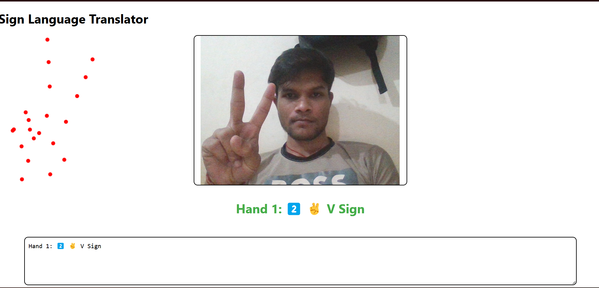

<h1>AI-Powered Sign Language Translator</h1>
This project is a real-time sign language translator that uses AI to detect hand gestures via a webcam and convert them into text and speech. 
It utilizes React for the frontend, TensorFlow.js for AI-based recognition, and MediaPipe Hands for hand tracking.

<h3>1️⃣ Project Features</h3>

✅ Real-time sign language recognition 
✅ Converts hand gestures into text 
✅ Text-to-speech (TTS) for spoken output 
✅ User-friendly UI with a live camera feed 
✅ Supports American Sign Language (ASL) (can be expanded to other sign languages)

<h3>2️⃣ Tech Stack</h3>
Frontend 
React.js – UI development 
Tailwind CSS – Styling 
Webcam API – Captures video input 
Speech Synthesis API – Converts text to speech 

<h3>3️⃣AI & ML</h3>
TensorFlow.js – Deep learning for sign recognition 
MediaPipe Hands – Hand tracking 
Pre-trained Models – Recognizes hand gestures 

<h3>4️⃣Project Architecture</h3>

1️⃣ Webcam Input – Captures the live hand movement 
2️⃣ Hand Detection – MediaPipe detects keypoints of the hand 
3️⃣ Feature Extraction – Extracts hand landmark coordinates 
4️⃣ Model Processing – TensorFlow.js interprets gestures 
5️⃣ Text Output – Converts gestures to text 
6️⃣ Speech Output – Reads the detected text using TTS 

<h3>5️⃣ Project Setup</h3>
<h4>Step 1: Initialize React App</h4>
npx create-react-app sign-language-translator 
cd sign-language-translator 
npm install 

<h4>Step 2: Install Dependencies</h4>
npm install @tensorflow/tfjs @tensorflow-models/handpose 
npm install @mediapipe/hands 
npm install react-webcam 

<h4>Step 3: Setup Webcam</h4>
import React from "react"; 
import Webcam from "react-webcam"; 

<h4>Step 4: Detect Hands with MediaPipe</h4>
Use MediaPipe Hands to detect landmarks (21 points on the hand). 
Connect it with TensorFlow.js to recognize gestures. 
import * as handpose from "@tensorflow-models/handpose"; 
import "@tensorflow/tfjs"; 

const detectHands = async (webcamRef) => { 
  const model = await handpose.load(); 
  const video = webcamRef.current.video; 

  setInterval(async () => { 
    const hand = await model.estimateHands(video); 
    console.log(hand); 
  }, 100); 
}; 
 
<h4>Step 5: Convert Gestures to Text</h4>
Use a pre-trained model or custom ML logic to classify hand gestures. 

<h4>Step 6: Text-to-Speech (TTS)</h4>
Use Speech Synthesis API to read out the detected text. 
const speak = (text) => {
  const speech = new SpeechSynthesisUtterance(text);
  window.speechSynthesis.speak(speech);
};

